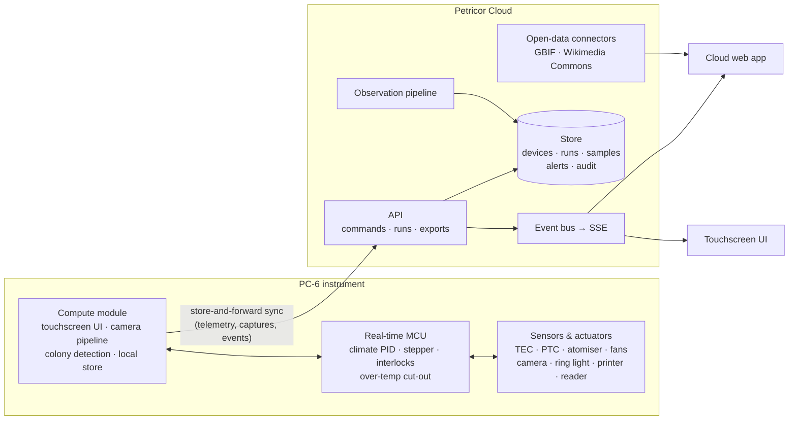
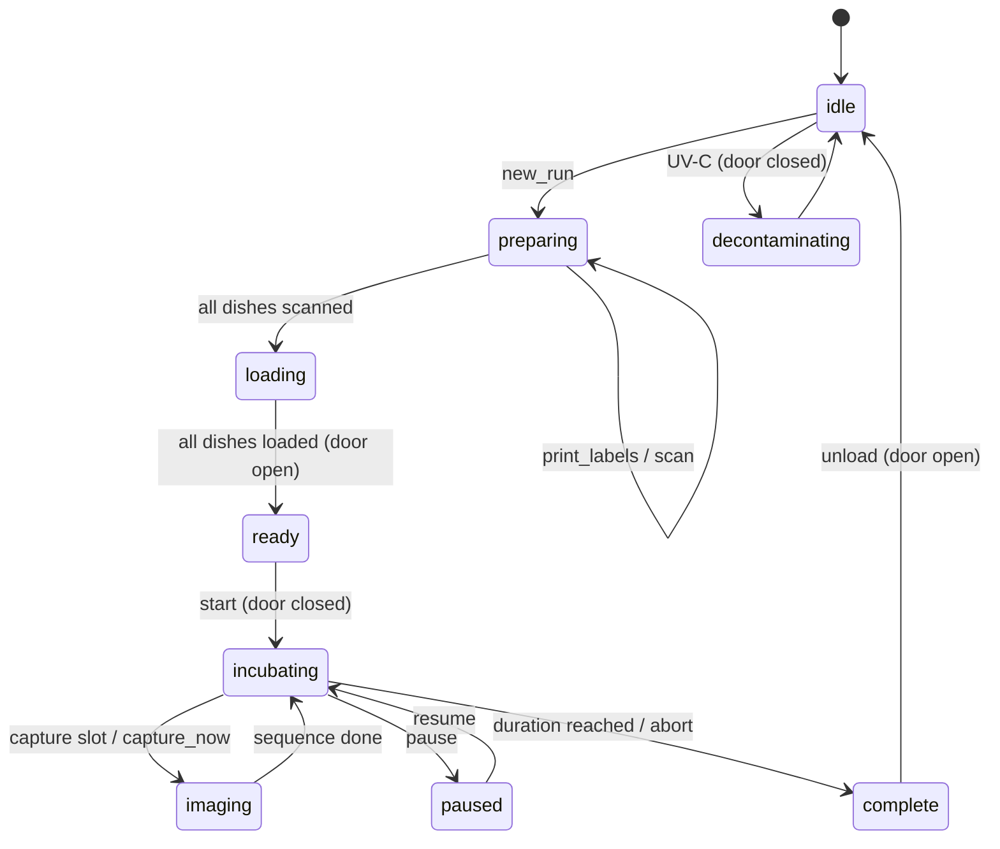
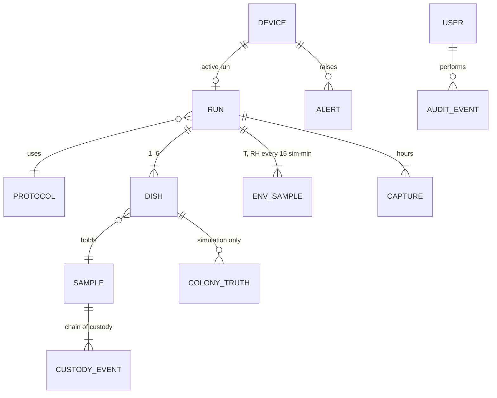

# Petricor — system architecture

Petricor is three things that share one data model:

1. **PC-6**: a benchtop incubator + imager for six 90 mm culture dishes (hardware, firmware, on-device UI).
2. **Petricor Cloud**: fleet, runs, samples, review/sign-off, reporting, reference data.
3. **The science layer**: growth modelling, colony observation records, species reference data.

This repository contains a working implementation of (2) and (3), a working on-device UI for (1), and a **device twin**. The twin is a software stand-in for PC-6 firmware, so the whole system runs end-to-end without hardware.

## In this repository

| Real product | Here |
|---|---|
| MCU firmware + compute-module services | `web/lib/server/twin.ts`: device twin with the same observable behaviour (state machine, climate dynamics, carousel motion, printer, reader, imaging cadence, interlocks, alarms) |
| Device ↔ cloud sync (MQTT/HTTPS, store-and-forward) | In-process event bus (`web/lib/server/bus.ts`); the offline device `Env Lab` shows how queued records are surfaced |
| On-device colony detection | `web/lib/server/pipeline.ts` derives colony records from simulated inocula via the growth model (`web/lib/science/colonies.ts`) |
| Camera frames | Procedurally rendered in the browser from colony records (`web/lib/viz/plate.ts`); no image files are stored |
| Postgres + object storage | Atomic JSON document store (`web/lib/server/store.ts`) |
| SSO (OIDC/SAML) | Persona sign-in with role-based permissions (`web/lib/server/session.ts`, `web/proxy.ts`) |

## Hardware electronics architecture (PC-6)

The instrument splits **safety-critical real-time control** from **everything else**. A UI crash can never leave the heat pump running.

- **Real-time control board** (Cortex-M class MCU)
  - PID loops for chamber temperature (Peltier heat pump, H-bridge; PTC warm-up heater) and humidity (ultrasonic atomiser duty).
  - Closed-loop stepper for the carousel (magnetic encoder, optical home sensor, jam detection).
  - Interlocks: door Hall sensor (stops motion and UV-C), independent over-temperature cut-out, reservoir float switch.
  - Talks to the compute module over a framed serial link; watchdog-supervised.
- **Compute module** (quad-core ARM)
  - Touchscreen UI (10.1″ 1280×800, glove-mode PCAP).
  - Camera pipeline (MIPI CSI-2, 12 MP) with four-channel ring-light sequencing and backlight.
  - Colony detection on each capture; the resulting observation records are what sync to the cloud.
  - Label printer (USB) and side reader (USB HID); encrypted local store with store-and-forward sync.
- **Power**: universal-input 24 V enclosed PSU → local regulators. Rear I/O: IEC inlet with switch, Gigabit Ethernet, 2× USB-A, USB-C service.

## Device state machine

Interlocks enforced by the twin (`command()` in `twin.ts`):
- Door locked while imaging and during UV-C.
- A dish can't be loaded until its barcode has been read at the side reader.
- Incubation can't start with the door open or with any dish unscanned or unloaded.
- Opening the door during incubation raises `DOOR_OPEN` and suppresses temperature alarms for 30 simulated minutes while the chamber recovers.
- Temperature more than 1 °C from setpoint after settling raises `TEMP_DEVIATION` (critical).

Imaging slots are scheduled at `lastCapture + interval` and recorded at their **planned** time. While a sequence runs, the twin caps its clock so fast simulation speeds never skip slots.

## Growth and observation model

- **Primary model**: radial growth is linear after an apparent lag. This is the model used by Gougouli & Koutsoumanis (2010), whose parameters we cite.
- **Secondary model**: Cardinal Model with Inflection (Rosso et al. 1993) for μ(T). Lag uses the same cardinal temperatures (the cited paper reports they are very close), with the cumulative-lag approach under changing temperature.
- **Dynamic temperature**: integrals ∫μ(T)dt and ∫1/λ(T)dt over the run's own logged chamber temperature (`integrate()` in `cmi.ts`). A door opening or a setpoint excursion therefore changes growth.
- **Per-colony variation**: lag and rate scale factors; contact inhibition at the dish wall and between neighbours.
- **Identification**: a **simulated** classifier whose confidence rises with colony size. It exists to exercise the review workflow and is labelled as simulated everywhere it appears.

Observation records are compact rows: `[id, x, y, r, key1, p1, key2, p2, key3, p3, firstSeenH]` per colony per capture (`pipeline.ts`). Every surface consumes the same payload: touchscreen, cloud timelapse, report and CSV export.

## API

| Method | Path | Purpose |
|---|---|---|
| GET | `/api/state?device=` | Snapshot: devices, protocols, users, samples, run summaries, alerts, latest frames, env tails |
| GET | `/api/stream?device=` | Server-Sent Events: `device` (≈4 Hz telemetry), `run`, `capture`, `alert`, `audit`, `print`, `scan` |
| POST | `/api/devices/:id/commands` | `door`, `new_run`, `add_sample`, `print_labels`, `scan`, `present`, `load`, `start`, `capture_now`, `pause`, `resume`, `abort`, `cancel_setup`, `unload`, `decontaminate`, `speed`, `refill` |
| GET | `/api/runs/:id/observations` | All frames for all dishes + environment log |
| POST | `/api/runs/:id/review` | Approve / request changes (role-checked, audited) |
| GET | `/api/runs/:id/export?format=csv\|json` | Per-colony results for LIMS import |
| GET | `/api/species/:key` | Species record + live GBIF summary + Commons images (cached 7 days) |
| POST/DELETE | `/api/session` | Demo persona sign-in / out |
| POST | `/api/alerts/:id` | Acknowledge (audited) |
| POST | `/api/admin/reset` | Restore seed data |

## Data model

`web/lib/domain/types.ts` is the source of truth. The key relationships:

`ColonyTruth` never leaves the server. Clients only receive observation records.

## Roles

| Capability | Technician | Microbiologist | Mycologist | Director |
|---|:-:|:-:|:-:|:-:|
| Operate instruments, register samples | ● | ● | ● | ● |
| Review & sign off results | | ● | ● | ● |
| Edit protocols | | ● | | ● |
| Manage users & integrations | | | | ● |

## Production path

- Replace `store.ts` with Postgres (runs, samples, audit) + object storage for real image sets. The route handlers and twin already go through one module.
- Device ↔ cloud over MQTT with per-device X.509 identity; the compute module keeps an encrypted queue and replays on reconnect (the `syncQueue` field models this).
- Append-only audit with hash chaining for electronic-records compliance work.
- SSO via OIDC/SAML mapping IdP groups to the four roles.
- Swap the simulated classifier for a trained detector and identifier; keep the observation-record contract unchanged.
