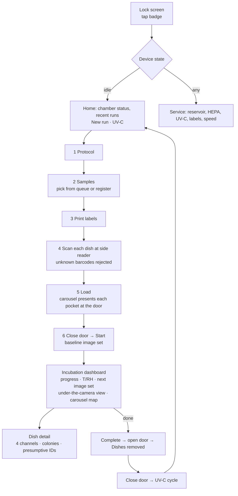

# User flows

Personas come from the original Petricor research: Dr. Alex Morgan (senior microbiologist), Dr. Emily Thompson (senior mycologist), Dr. Jane Miller (environmental mycologist), Dr. Michael Brown (lab director), plus a lab technician (Sam Ortiz). Research showed that trust in the physical workflow comes first, so the device flow is linear, interruptible and verifiable at every step.

## On the instrument (`/device`)

What a person does with their hands is kept in the **At the bench** panel, not on the touchscreen: lifting the door, taking printed labels, presenting dishes to the reader, refilling the reservoir. That keeps the touchscreen honest about what it can and can't control.

Error states the UI handles: door open during incubation (warning banner, alarm suppression while recovering), temperature deviation (critical banner), reservoir low, scanning an unknown barcode, loading before scanning, starting with the door open, and abort (with confirmation).

## In the cloud (`/app`)

| Persona | Primary path |
|---|---|
| Technician | Overview → live run → dish → back to bench. Samples to register and check custody. |
| Senior microbiologist | Overview **Review queue** → Run → timelapse, colonies, environment → **Approve / Request changes** → Report / CSV |
| Mycologist | Run → colony detail (diameter over time, radial rate, alternatives) → Species reference (growth model, GBIF, Commons) → Mycelium lab |
| Lab director | Overview KPIs → Instruments (fleet, consumables, offline queue) → Audit trail → Settings (roles, protocols, integrations) |

Every review, alert acknowledgement and run lifecycle event lands in the append-only audit trail.
